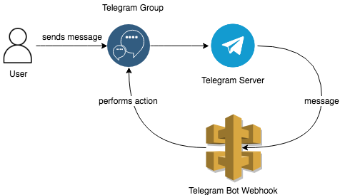

# telegram-group-moderator-bot
[](https://circleci.com/gh/fernnetwork/telegram-group-moderator-bot)
[](https://s3-eu-west-1.amazonaws.com/ab-ci-reports/telegram-group-moderator-bot/master/lcov-report/index.html)

Telegram group moderator bot for protecting a telegram group from scams.

The bot monitors contents in a Telegram group, and
- Deletes any message that contains a url
- Deletes any message that contains an ethereum address
- Deletes any photos, videos, file uploads, and stickers.

The above checks are configurable in `env.yml` (see details below).

## How it works
This repository contains a webhook API receives incoming messages and deletes any inappropriate contents.


## Setting up the bot
The project is built using [Serverless Framework](https://serverless.com/). The below section describe the steps required to deploy the API to AWS and set up the telegram bot.

Steps
1. Create a new bot by sending the `/newbot` command to [BotFather](https://telegram.me/botfather)
2. Follow the on screen instructions to set up the bot. You will get a `bot token` once it's been set up.
3. Add your bot user to the telgram group as an admin user.
4. [Deploy the API](#deploying-the-api).
5. [Set up the Web Hook](#setting-the-webhook) with Telegram, using the bot token received in the earlier step.
6. The bot should now be doing its job! Try sending a url in the group, and see if it gets deleted by the bot.

The deleted messages are logged, so you should be able to see them in CloudWatch logs if you're using AWS.

## Deploying the API

### Pre-requisites
1. [Node.js](https://nodejs.org/en/download/) v8.10 or later.
2. Serverless CLI v1.28.0. You can run `npm install -g serverless` to install it.
3. An AWS account. If you don't already have one, you can sign up for a [free trial](https://aws.amazon.com/s/dm/optimization/server-side-test/free-tier/free_np/) that includes 1 million free Lambda requests per month.
4. Set-up your [Provider Credentials](https://serverless.com/framework/docs/providers/aws/guide/credentials/).

### Steps
1. Clone this project and install dependencies
```
$ git clone https://github.com/fernnetwork/telegram-group-moderator-bot.git
$ cd telegram-group-moderator-bot && npm install
```
2. Under the project directory, create `env.yml` and fill in your configuration.
```
default:
  # Token received from BotFather after creating the bot
  TELEGRAM_BOT_TOKEN: 510243865:AAF9DKyg-ddVk_SFrtIK0pkMRXQ73qFqLhc
  # Optional. Comma separated list of whitelisted username. Message from these users are ignored by the bot.
  WHITELIST_USERS: fern_support,fern_marketing
  # Optional. Comma separated list of checks to disable. Possible values: url, ethAddress, photo, video, document, sticker
  DISABLED_CHECKS: sticker
```
3. Deploy the webhook API
```
$ sls deploy
```

The URL of the API will be printed in console upon successful deployment. Use this URL to register the webhook with Telegram.

## Setting the Webhook
This step registers the webhook with Telegram so that Telegram sends a request to the webhook API when a new message is received by the bot.

```
$ bash set-webhooks.sh <bot_token> <web_hook_api_url>

# Example:
# $ bash set-webhooks.sh 510243865:AAF9DKyg-ddVk_SFrtIK0pkMRXQ73qFqLhc https://diva0rqm4g.execute-api.eu-west-1.amazonaws.com/dev/webhook
```
